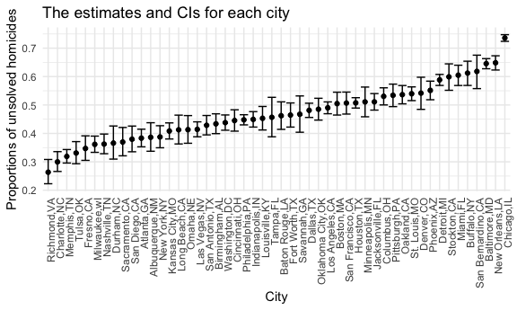

p8105_hw5_yc4195.Rmd
================

    ## ── Attaching packages ─────────────────────────────────────── tidyverse 1.3.2 ──
    ## ✔ ggplot2 3.3.6      ✔ purrr   0.3.4 
    ## ✔ tibble  3.1.8      ✔ dplyr   1.0.10
    ## ✔ tidyr   1.2.0      ✔ stringr 1.4.1 
    ## ✔ readr   2.1.2      ✔ forcats 0.5.2 
    ## ── Conflicts ────────────────────────────────────────── tidyverse_conflicts() ──
    ## ✖ dplyr::filter() masks stats::filter()
    ## ✖ dplyr::lag()    masks stats::lag()

## Problem 1

## Problem 2

``` r
homicide_df = 
  read_csv("homicide-data.csv") %>% 
  mutate(
    city_state = str_c(city, state, sep = ","),
    resolve = case_when(
      disposition == "Closed without arrest" ~ "unsolved",
      disposition == "Open/No arrest"        ~ "unsolved",
      disposition == "Closed by arrest"      ~ "solved",
    )) %>% 
  relocate(city_state) %>% 
  filter(city_state != "Tulsa,AL")
```

    ## Rows: 52179 Columns: 12
    ## ── Column specification ────────────────────────────────────────────────────────
    ## Delimiter: ","
    ## chr (9): uid, victim_last, victim_first, victim_race, victim_age, victim_sex...
    ## dbl (3): reported_date, lat, lon
    ## 
    ## ℹ Use `spec()` to retrieve the full column specification for this data.
    ## ℹ Specify the column types or set `show_col_types = FALSE` to quiet this message.

``` r
unsolved = 
  homicide_df %>% 
  group_by(city_state) %>% 
  summarize(unsolved = sum(resolve == "unsolved"),
            total_number = n()) 
unsolved
```

    ## # A tibble: 50 × 3
    ##    city_state     unsolved total_number
    ##    <chr>             <int>        <int>
    ##  1 Albuquerque,NM      146          378
    ##  2 Atlanta,GA          373          973
    ##  3 Baltimore,MD       1825         2827
    ##  4 Baton Rouge,LA      196          424
    ##  5 Birmingham,AL       347          800
    ##  6 Boston,MA           310          614
    ##  7 Buffalo,NY          319          521
    ##  8 Charlotte,NC        206          687
    ##  9 Chicago,IL         4073         5535
    ## 10 Cincinnati,OH       309          694
    ## # … with 40 more rows

The data set consists of 52178 cases, and 14 variables that include the
time, location, and type of killing, whether an arrest was made, and
basic demographic information about each victim.

``` r
 Baltimore_df =
  unsolved %>% 
  filter(city_state == "Baltimore,MD")

prop.test(
   Baltimore_df %>% pull(unsolved), 
   Baltimore_df %>% pull(total_number)) %>% 
  broom::tidy()
```

    ## # A tibble: 1 × 8
    ##   estimate statistic  p.value parameter conf.low conf.high method        alter…¹
    ##      <dbl>     <dbl>    <dbl>     <int>    <dbl>     <dbl> <chr>         <chr>  
    ## 1    0.646      239. 6.46e-54         1    0.628     0.663 1-sample pro… two.si…
    ## # … with abbreviated variable name ¹​alternative

The estimated proportion of homicides in Baltimore is 64.6% and its 95%
confidence interval is \[62.8%, 66.3%\].

``` r
prop_df = unsolved %>% 
  mutate(
    test = map2(.x = unsolved, .y = total_number, ~prop.test(x = .x, n = .y)),
    test = map(test,broom::tidy)
         )  %>% 
  unnest() %>% 
  select(city_state, estimate, conf.low, conf.high) %>%
  arrange(desc(estimate))
```

    ## Warning: `cols` is now required when using unnest().
    ## Please use `cols = c(test)`

``` r
plot_df=
  prop_df%>% 
  ggplot(aes(x = reorder(city_state,estimate), y =estimate))+
  geom_point()+
  geom_errorbar(aes(ymin = conf.low, ymax = conf.high)) + 
  theme(axis.text.x = element_text(angle = 90, vjust = 0.9, hjust = 1))+
  labs(title = "The estimates and CIs for each city",x = "City", y = "Proportions of unsolved homicides")
plot_df
```



## Problem 3

``` r
set.seed(5000)
t_test = function(samp_size, miu = 0, sigma = 5){
  sim_data = 
    tibble(
      x = rnorm(n = samp_size, mean = miu, sd = sigma)
    )
  
  sim_data %>%
  t.test(mu = 0, conf.level = 0.95) %>%
  broom::tidy() %>% 
  select(estimate, p.value)
}
```
