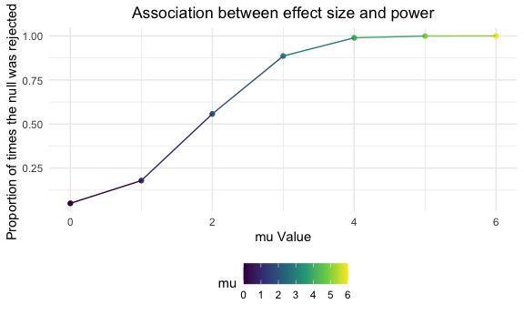

p8105_hw5_yc4195.Rmd
================
Yimin Chen
November 08, 2022

    ## ── Attaching packages ─────────────────────────────────────── tidyverse 1.3.2 ──
    ## ✔ ggplot2 3.3.6      ✔ purrr   0.3.4 
    ## ✔ tibble  3.1.8      ✔ dplyr   1.0.10
    ## ✔ tidyr   1.2.0      ✔ stringr 1.4.1 
    ## ✔ readr   2.1.2      ✔ forcats 0.5.2 
    ## ── Conflicts ────────────────────────────────────────── tidyverse_conflicts() ──
    ## ✖ dplyr::filter() masks stats::filter()
    ## ✖ dplyr::lag()    masks stats::lag()

## Problem 1

## Problem 2

``` r
homicide_df = 
  read_csv("homicide-data.csv") %>% 
  mutate(
    city_state = str_c(city, state, sep = ","),
    resolve = case_when(
      disposition == "Closed without arrest" ~ "unsolved",
      disposition == "Open/No arrest"        ~ "unsolved",
      disposition == "Closed by arrest"      ~ "solved",
    )) %>% 
  relocate(city_state) %>% 
  filter(city_state != "Tulsa,AL")
```

    ## Rows: 52179 Columns: 12
    ## ── Column specification ────────────────────────────────────────────────────────
    ## Delimiter: ","
    ## chr (9): uid, victim_last, victim_first, victim_race, victim_age, victim_sex...
    ## dbl (3): reported_date, lat, lon
    ## 
    ## ℹ Use `spec()` to retrieve the full column specification for this data.
    ## ℹ Specify the column types or set `show_col_types = FALSE` to quiet this message.

``` r
unsolved = 
  homicide_df %>% 
  group_by(city_state) %>% 
  summarize(unsolved = sum(resolve == "unsolved"),
            total_number = n()) 
unsolved
```

    ## # A tibble: 50 × 3
    ##    city_state     unsolved total_number
    ##    <chr>             <int>        <int>
    ##  1 Albuquerque,NM      146          378
    ##  2 Atlanta,GA          373          973
    ##  3 Baltimore,MD       1825         2827
    ##  4 Baton Rouge,LA      196          424
    ##  5 Birmingham,AL       347          800
    ##  6 Boston,MA           310          614
    ##  7 Buffalo,NY          319          521
    ##  8 Charlotte,NC        206          687
    ##  9 Chicago,IL         4073         5535
    ## 10 Cincinnati,OH       309          694
    ## # … with 40 more rows

The data set consists of 52178 cases, and 14 variables that include the
time, place, and nature of the murder, whether an arrest was made, and
basic demographic information about each victim.

``` r
 Baltimore_df =
  unsolved %>% 
  filter(city_state == "Baltimore,MD")

prop.test(
   Baltimore_df %>% pull(unsolved), 
   Baltimore_df %>% pull(total_number)) %>% 
  broom::tidy()
```

    ## # A tibble: 1 × 8
    ##   estimate statistic  p.value parameter conf.low conf.high method        alter…¹
    ##      <dbl>     <dbl>    <dbl>     <int>    <dbl>     <dbl> <chr>         <chr>  
    ## 1    0.646      239. 6.46e-54         1    0.628     0.663 1-sample pro… two.si…
    ## # … with abbreviated variable name ¹​alternative

The estimated proportion of homicides in Baltimore is 64.6% and its 95%
confidence interval is \[62.8%, 66.3%\].

``` r
prop_df = unsolved %>% 
  mutate(
    test = map2(.x = unsolved, .y = total_number, ~prop.test(x = .x, n = .y)),
    test = map(test,broom::tidy)
         )  %>% 
  unnest() %>% 
  select(city_state, estimate, conf.low, conf.high) %>%
  arrange(desc(estimate))
```

    ## Warning: `cols` is now required when using unnest().
    ## Please use `cols = c(test)`

``` r
plot_df=
  prop_df%>% 
  ggplot(aes(x = reorder(city_state,estimate), y =estimate))+
  geom_point()+
  geom_errorbar(aes(ymin = conf.low, ymax = conf.high)) + 
  theme(axis.text.x = element_text(angle = 90, vjust = 0.9, hjust = 1))+
  labs(title = "The estimates and CIs for each city",x = "City", y = "Proportions of unsolved homicides")
plot_df
```


## Problem 3

``` r
set.seed(5000)
estimate_test = function(n=30, mu, sigma = 5) {
  
  sim_data = tibble(
    x = rnorm(n=n, mean = mu, sd = sigma)
  )
  
  sim_data %>% 
        summarize(t_test =t.test(x,mu = 0, conf.level = 0.95) %>%
        broom::tidy() %>% 
        select(estimate, p.value))
}


sim_test =
  rerun(5000, estimate_test(mu = 0)) %>% 
  bind_rows()%>% 
  mutate(
    mu_hat = pull(t_test,estimate),
    p_value = pull(t_test,p.value)) %>% 
  select(-t_test)

sim_test
```

    ## # A tibble: 5,000 × 2
    ##    mu_hat p_value
    ##     <dbl>   <dbl>
    ##  1 -0.357  0.655 
    ##  2  1.03   0.189 
    ##  3 -0.965  0.462 
    ##  4 -0.704  0.370 
    ##  5  1.27   0.185 
    ##  6  1.62   0.0655
    ##  7 -2.09   0.0638
    ##  8  0.341  0.785 
    ##  9 -1.32   0.0895
    ## 10  0.128  0.859 
    ## # … with 4,990 more rows

``` r
sim_test1 =
  tibble(
    mu = c(0,1,2,3,4,5,6)
  ) %>% 
  mutate(
    output_lists = map(.x = mu, ~rerun(5000, estimate_test(n=30,mu = .x))),
    estimate_dfs = map(output_lists, bind_rows)) %>% 
  select(-output_lists) %>% 
  unnest(estimate_dfs)%>%
  mutate(
    mu_hat = pull(t_test,estimate),
    p_value = pull(t_test,p.value))%>% 
  select(mu, mu_hat, p_value)

sim_test1
```

    ## # A tibble: 35,000 × 3
    ##       mu  mu_hat p_value
    ##    <dbl>   <dbl>   <dbl>
    ##  1     0  1.12    0.245 
    ##  2     0  0.120   0.890 
    ##  3     0 -0.0637  0.947 
    ##  4     0  0.404   0.639 
    ##  5     0  0.555   0.588 
    ##  6     0  0.827   0.331 
    ##  7     0 -1.96    0.0250
    ##  8     0 -0.655   0.579 
    ##  9     0  0.0532  0.946 
    ## 10     0  0.0624  0.941 
    ## # … with 34,990 more rows

``` r
proportionplot =
  sim_test1 %>% 
  group_by(mu) %>% 
  summarize(total_number = n(),rejected_number = sum(p_value < 0.05)) %>% 
  mutate(proportion = rejected_number / total_number) %>% 
  ggplot(aes(x = mu, y = proportion,color=mu)) +
  geom_point() +
  geom_line()+
  labs(
    title = "Association between effect size and power",
    x = "mu Value",
    y = "Proportion of times the null was rejected "
  ) + 
  theme(plot.title = element_text(hjust = 0.5))
proportionplot
```



The proportion of times the null is rejected increases as mu increases.
Therefore, as the size of the effect increases, its power also
increases.

``` r
plot1 =
  sim_test1%>% 
  group_by(mu) %>%
  summarize(avg_muhat = mean(mu_hat)
  ) %>% 
  ggplot(aes(x = mu, y = avg_muhat,color=mu)) + 
  geom_point() +
  geom_line() +
  labs(
    x = "True mu Value",
    y = "Average estimate of mu",
    title = "Total datasets"
  ) + 
  theme(plot.title = element_text(hjust = 0.5))


plot2 =
  sim_test1%>% 
  filter(p_value < 0.05) %>% 
  group_by(mu) %>%
  summarize(
    avg_muhat = mean(mu_hat)
  ) %>% 
  ggplot(aes(x = mu, y = avg_muhat,color=mu)) + 
  geom_point() +
  geom_line() +
  labs(
    x = "True mu Value",
    y = "Average estimate of mu",
    title = "Total rejected datasets"
  ) + 
  theme(plot.title = element_text(hjust = 0.5))
```

``` r
plot1 + plot2
```


In the combined plot, we can see when the effect size/true value of mu
is small (from 0 to 3), he sample average of mu hat across tests for
which the null is rejected was not equal to the true value of
mu.However, the average estimate of mu approximates the true mu value
when the effect size is between 4 and 6. That is to say, since as the
size of the effect increases, its power also increases, and the average
estimate of mu gradually approximates or equal to the true mu value.
